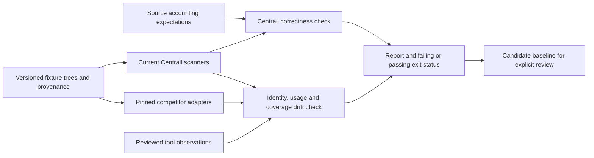

# Comparison scope and corpus provenance

The suite compares implementations with the same file trees and with explicit
source expectations. Competitor agreement is supporting evidence, never a vote
that can override source accounting. A known competitor discrepancy is a reviewed
observation, not permission for Centrail to reproduce it.

## Implementations

| Implementation | Relevant comparison boundary |
|---|---|
| Centrail | Current local scanners: record identity, session association, token buckets and quarantine diagnostics |
| [Tokscale](https://github.com/junhoyeo/tokscale/tree/d4d1c751856e25913bce97bfbd7b254308863239) | Pinned uncached local parser API; full record and dedup evidence retained |
| [ccusage](https://github.com/ccusage/ccusage) | Pinned 20.0.24 native executable, offline daily aggregates; aggregate agreement cannot establish matching request identities |
| [Claude Code Usage Monitor](https://github.com/Maciek-roboblog/Claude-Code-Usage-Monitor/tree/c59a83bf943f329f0e61f1a29c760353ee1860a5) | Independent Python Claude reader, explicit fixture path; other source types are not applicable |

This is a bounded implementation set, not a claim to test every tracker. Selection
requires an executable local-data boundary, a pinned implementation, a comparable
quantity and fixture-only execution. Tools outside that boundary need a separate
adapter and evidence before their name counts as coverage.

[CodexBar](https://github.com/steipete/CodexBar) is relevant for later local cost-scan
comparison, but also exposes provider limits, account spend and credentials-backed
surfaces. Those quantities cannot be compared to transcript tokens interchangeably.
[token-stats](https://github.com/Annihilater/token-stats) has overlapping source
readers and Tokscale-related paths; it is not counted as another independent vote.
Neither is executed by the current suite. No account-limit APIs, browser sessions,
OAuth credentials or live customer logs are involved.

## Corpus

Each fixture has source expectations, a reason, an explicit file tree and provenance.
Three kinds must remain distinguishable:

- **Public upstream fixture:** retain the source URL, immutable revision, path,
  original-byte digest and applicable license. This proves provenance, not that the
  fixture was captured from a real user.
- **Derived/generated regression:** record the source case and transformations.
  Copies, nested directories, active/archive overlap, forks, partial tails, streaming
  updates, subagents and resumed segments exercise specific invariants.
- **Reviewed real capture:** requires an explicitly supplied snapshot, permission,
  redaction review and retained transformation record. None is claimed in this cut.

No local-history importer or automatic personal-log discovery is part of the suite.
The old implicit-home control script is replaced with the fixture-suite entry point.
An anonymized real capture must preserve the relationships that matter: equal request
IDs stay equal, forks retain parent relationships, token values remain exact, and file
placement still tests the original discovery issue. Removing text is insufficient if
paths, session labels, repository names or source timestamps still identify someone.

Copilot shutdown fixtures are model/segment aggregates; they do not reconstruct one
record per provider request. ccusage daily totals similarly cannot verify request
counts or session association. The report records these granularity limits instead
of fabricating comparable IDs.

## What drift means

- Source mismatch: Centrail no longer satisfies an independently specified fixture.
- Identity/diagnostic drift: totals may agree while event identity, sessions or
  quarantine behavior change.
- Competitor drift: a pinned tool's comparable output differs from its reviewed
  observation, including an upstream improvement. Review before replacing a baseline.
- Coverage drift: a required tool disappears or a previously compared source becomes
  unsupported. An unavailable binary or failed isolation is not a passing skip.
- Tool/corpus change: new versions and changed fixtures require an explicit baseline
  review; the command emits a candidate without promoting it automatically.

Financial values are not an invoice comparison. Tokscale's helper has pricing
disabled; ccusage's retained raw report can contain its bundled offline estimates.
The current gate compares usage and identity, not dollar equality across different
price snapshots or subscription assumptions. Centrail's calculation-library tests
cover exact arithmetic, source dimensions and artifact replay separately. A future
pricing comparator must pin the tariff, effective date, provider route, service
class and cache duration before treating amounts as comparable.

File-tree parser fixtures complement existing real-git CLI integration tests for
worktrees, siblings, deleted checkouts, scope and attribution. They do not replace
those tests or assert that competitors implement Centrail's repository-placement
policy. Third-party execution currently uses Linux isolation; the ordinary CLI
fixture tests retain their native Windows/macOS/Linux CI matrix.
